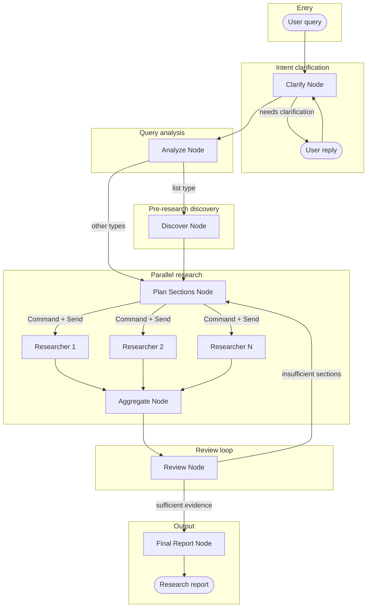

# Research Agent

A deep research agent built with LangGraph, LangChain, and DeepAgents, using native HTTP/API tools (ArXiv, Hacker News, Hugging Face, Tavily, RSS, GitHub, and more) for comprehensive AI research.

**Languages:** [English](README.md) · [简体中文](README.zh-CN.md)

## Features

- **Deep Research Mode**: Section-based parallel research with intent clarification, query analysis, entity discovery, review loops, and structured report generation
- **Smart Query Analysis**: Automatically identifies query types (list/comparison/deep_dive/general) and optimizes research strategy
- **Entity Discovery**: For "list" queries (e.g., "What are the best X?"), discovers all relevant entities before deep diving
- **ArXiv Search**: Search and retrieve academic papers using ArXiv's official API
- **Hacker News Integration**: Trending and discussion data via the official Hacker News Firebase API (`src/tools/hacker_news.py`)
- **Hugging Face Daily Papers**: Fetch daily featured AI/ML papers with titles and abstracts
- **Hugging Face Blog**: Browse official and community blog posts with metadata
- **Multi-LLM Support**: Works with Aliyun (qwen3.5-plus, qwen3-max, kimi-k2.5), Anthropic Claude, and OpenAI GPT
- **Thinking Mode**: Optional thinking mode for supported models (qwen3.5-plus, qwen3-max, kimi-k2.5)
- **Modular Architecture**: High cohesion, low coupling design for easy extension
- **Clerk Authentication**: Uses [Clerk](https://clerk.com/) for user sign-in; unified auth for Web UI and API

## Two Research Modes

| Feature | Normal Mode | Deep Research Mode |
|---------|-------------|-------------------|
| Execution | Single-turn ReAct | Multi-turn state machine |
| Intent Clarification | None | Supported (skippable) |
| Query Analysis | None | Identifies query type (list/comparison/deep_dive/general) |
| Entity Discovery | None | Pre-research discovery for "list" queries |
| Research Planning | Implicit | Explicit section generation |
| Parallel Execution | None | Section-based parallel research |
| Review Mechanism | None | Review node evaluates evidence sufficiency |
| Context Management | Accumulates all messages | Researcher-level compression |
| Use Case | Simple queries, quick lookups | In-depth research, comprehensive reports |

## Architecture

### Deep Research Graph Flow


```mermaid
graph TB
    subgraph entry [Entry]
        Start([User query])
    end

    subgraph clarify_phase [Intent clarification]
        Clarify[Clarify Node]
        UserInput([User reply])
        Clarify -->|needs clarification| UserInput
        UserInput --> Clarify
    end

    subgraph analyze_phase [Query analysis]
        Analyze[Analyze Node]
    end

    subgraph discovery_phase [Pre-research discovery]
        Discover[Discover Node]
    end

    subgraph parallel [Parallel research]
        Plan[Plan Sections Node]
        R1[Researcher 1]
        R2[Researcher 2]
        RN[Researcher N]
        Aggregate[Aggregate Node]

        Plan -->|Command + Send| R1
        Plan -->|Command + Send| R2
        Plan -->|Command + Send| RN
        R1 --> Aggregate
        R2 --> Aggregate
        RN --> Aggregate
    end

    subgraph review_loop [Review loop]
        Review[Review Node]
        Review -->|insufficient sections| Plan
    end

    subgraph output [Output]
        Report[Final Report Node]
        Final([Research report])
    end

    Start --> Clarify
    Clarify --> Analyze
    Analyze -->|list type| Discover
    Analyze -->|other types| Plan
    Discover --> Plan
    Aggregate --> Review
    Review -->|sufficient evidence| Report
    Report --> Final
```

## Prerequisites

- Python 3.11+
- [uv](https://github.com/astral-sh/uv) (recommended) or pip
- API key for Aliyun DashScope (default), Anthropic, or OpenAI
- Keys for optional integrations as needed: Jina or Zyte (content reader), Tavily (web search), etc. — see `env.example`
- Clerk account and keys (required when using the Web UI; see [Clerk authentication](#clerk-authentication))

## Installation

### 1. Clone the repository

```bash
git clone <repository-url>
cd research-agent
```

### 2. Set up the environment with uv

```bash
# Install uv if not already installed
curl -LsSf https://astral.sh/uv/install.sh | sh

# Create virtual environment and install dependencies
uv venv
source .venv/bin/activate  # On Windows: .venv\Scripts\activate
uv pip install -e .
```

### 3. Configure Environment Variables

Create a `.env` file in the project root:

```bash
cp env.example .env
```

Edit `.env` and add your API keys:

```bash
# Aliyun DashScope (Default)
# Get your key from: https://dashscope.console.aliyun.com/
ALIYUN_API_KEY=your-aliyun-dashscope-api-key

# Available models: qwen3.5-plus (default), qwen3-max, kimi-k2.5

# Or use alternative providers:
# ANTHROPIC_API_KEY=your-anthropic-api-key
# OPENAI_API_KEY=your-openai-api-key

# Jina API Key (for web content reading)
# Get your key from: https://jina.ai/
JINA_API_KEY=your-jina-api-key

# Optional model defaults (CLI / API request has higher priority)
# MODEL_PROVIDER=aliyun
# MODEL_NAME=qwen3.5-plus
# ENABLE_THINKING=false

# Optional Deep Research defaults
# DEEP_RESEARCH_MAX_ITERATIONS=2
# DEEP_RESEARCH_MAX_CONCURRENT=5
# DEEP_RESEARCH_MAX_TOOL_CALLS=10
# DEEP_RESEARCH_ALLOW_CLARIFICATION=true
```

## Web UI & API

This project provides a Web UI and backend API service, allowing you to use the research agent through a web browser.

### Starting the Backend API

The backend uses FastAPI and provides RESTful API and streaming support.

```bash
# Start with uvicorn (development mode with hot reload, port 8112)
ENV=development uv run uvicorn src.api.main:app --reload --port 8112

# Or use Python module approach (auto-selects port 8112 when ENV=development)
ENV=development uv run python -m src.api.main
```

The API service port depends on the environment:

| Environment | Default Port |
|-------------|-------------|
| Development | 8112 |
| Production  | 8111 |

You can override via environment variables:

```bash
API_HOST=0.0.0.0  # Default 0.0.0.0
API_PORT=8112     # Explicit override (takes priority over ENV-based default)
```

### Production Deployment

For production environments, it is recommended to use `uv run` to ensure environment consistency and disable hot reload:

```bash
# Start with uvicorn (production mode)
# Logs will be written to logs/app.log in the project root (auto-created if not exists)
ENV=production uv run uvicorn src.api.main:app --host 0.0.0.0 --port 8111  # Production uses 8111

# Custom log path (optional)
ENV=production LOG_FILE=/path/to/your/app.log \
  uv run uvicorn src.api.main:app --host 0.0.0.0 --port 8111  # Production uses 8111
```


### Starting the Frontend UI

The frontend is built with Next.js and located in the `web-ui/` directory.

```bash
# Navigate to the frontend directory
cd web-ui

# Install dependencies (first time only)
npm install

# Start the development server
npm run dev

# Or build for production
npm run build && cp -r .next/static .next/standalone/.next/static
npm run start:prod
```

The frontend development server runs on `http://localhost:3001` by default (production uses port 3000).

**Important**: The frontend needs to connect to the backend API, so make sure the backend service is running first.

### Clerk authentication

The Web UI and API use [Clerk](https://clerk.com/) for sign-in and unified identity across frontend and backend.

#### Obtaining Clerk keys

1. Open the [Clerk Dashboard](https://dashboard.clerk.com/)
2. Create an application or select an existing one
3. On the **API Keys** page, copy:
   - **Publishable Key** — frontend (`pk_…`)
   - **Secret Key** — backend (`sk_…`)

#### Frontend configuration

In `web-ui/`, create `.env.local` (see `web-ui/.env.local.example`):

```bash
NEXT_PUBLIC_CLERK_PUBLISHABLE_KEY=pk_test_xxxx
CLERK_SECRET_KEY=sk_test_xxxx
```

#### Backend configuration

Add to the project root `.env`:

```bash
# Clerk Authentication (required for API protection)
CLERK_SECRET_KEY=sk_test_xxxx
# Optional: comma-separated allowed frontend origins (defaults include localhost dev URLs)
# CLERK_AUTHORIZED_PARTIES=http://localhost:3000,https://your-production-domain.com
```

#### Deployment notes

In production with Next.js standalone mode, ensure Clerk env vars are loaded (e.g. via `dotenv-cli`). See [Deployment troubleshooting — Clerk secretKey missing](docs/deployment-network-troubleshooting.md#31-clerk-secretkey-缺失).

## Usage

### Interactive Mode

```bash
# Run with default settings (Aliyun qwen3.5-plus)
uv run python -m src.main

# Use kimi-k2.5 model
uv run python -m src.main --model kimi-k2.5

# Enable thinking mode (shows model's reasoning process)
uv run python -m src.main --enable-thinking
uv run python -m src.main --model kimi-k2.5 --enable-thinking

# Use Anthropic or OpenAI instead
uv run python -m src.main -p anthropic
uv run python -m src.main -p openai
uv run python -m src.main -p openrouter --model openai/gpt-4o
```

### Single Query Mode

```bash
uv run python -m src.main -q "Summarize today's trending topics on Hacker News and Hugging Face papers in a detailed report" -v

# With thinking mode enabled
uv run python -m src.main -q "Analyze the latest LLM paper trends" --enable-thinking -v
```

### Deep Research Mode

Deep Research Mode uses a section-based parallel architecture for comprehensive research tasks. It includes intent clarification, structured section planning, parallel research execution, and iterative review.

```bash
# Interactive mode
uv run python -m src.main --deep-research

# With a query
uv run python -m src.main --deep-research -q "What are the latest advances in RAG?"

# Custom review iterations (default: 2)
uv run python -m src.main --deep-research --max-iterations 3 -q "Compare the technical architecture of Llama 3 and GPT-4"

# With verbose logging
uv run python -m src.main --deep-research -v

# Specify LLM provider
uv run python -m src.main --deep-research -p anthropic -q "Evolution of attention mechanisms in Transformers"

# Use a specific model
uv run python -m src.main --deep-research --model kimi-k2.5 -q "Latest techniques for LLM inference optimization"
```

Deep Research parameter precedence: **CLI arguments > environment variables > defaults**.  
Defaults: `max_iterations=2`, `max_concurrent=5`, `max_tool_calls=10`.  
Allowed ranges: `max_iterations` 1–5, `max_concurrent` 1–10, `max_tool_calls` 1–20.

**Deep Research Flow:**
1. **Clarify** - Asks clarifying questions if the query is ambiguous (can be skipped)
2. **Analyze** - Identifies query type (list/comparison/deep_dive/general) and determines output format
3. **Discover** (list queries only) - Performs broad search to discover all relevant entities before deep research
4. **Plan Sections** - Generates 3-7 independent research sections based on query or discovered entities
5. **Parallel Research** - Each section is researched in parallel using available tools
6. **Review** - Evaluates evidence sufficiency across all sections
7. **Iterate or Report** - If gaps exist, re-research specific sections; otherwise generate final report

For detailed architecture documentation, see [`src/deep_research/README.md`](src/deep_research/README.md).

### Programmatic Usage

#### Normal Mode

```python
from src.agent.research_agent import run_research

result = run_research(
    query="Summarize today's Hugging Face papers on transformers",
    model_provider="aliyun",  # or "anthropic", "openai", "openrouter"
    model_name="qwen3.5-plus",
    enable_thinking=True,  # optional; supported on some DashScope models
)
print(result)
```

For async callers, use `run_research_async` from the same module.

#### Deep Research Mode

```python
import asyncio
from src.deep_research import build_deep_research_graph, run_deep_research

async def main():
    # Build the deep research graph (tools are assembled inside the graph)
    graph = build_deep_research_graph(
        model_provider="aliyun",
        model_name="qwen3.5-plus",
    )

    # Define clarification callback (optional)
    async def on_clarify(question: str) -> str:
        return input(f"Agent asks: {question}\nYour answer: ")

    # Configuration
    config = {
        "configurable": {
            "thread_id": "research-session-1",
            # Preferred keys (new naming)
            "max_tool_calls": 10,
            "max_iterations": 2,
            "model_provider": "aliyun",
            "model_name": "qwen3.5-plus",
        }
    }

    # Run deep research
    report = await run_deep_research(
        query="Latest techniques for LLM inference optimization",
        graph=graph,
        config=config,
        on_clarify_question=on_clarify,
    )
    print(report)

asyncio.run(main())
```

## Available Tools

Configured tools depend on **mode** and **which agent** is running. The table below counts **business tools** registered in this repo (exact names and source files are in the linked doc).

| Context | # of tools | What it covers |
|---------|------------|----------------|
| **Main agent** (normal / interactive mode) | **21** | ArXiv, Hugging Face papers & blog, GitHub search, Tavily, Zyte article list, RSS trio, Hacker News (Firebase API) |
| **Content reader subagent** | **2** | GitHub README fetch + **one** URL reader (`jina` or `zyte`, see below) |
| **Deep Research — researcher / discover** | **22** | 20 research tools + `research_complete` + `think` (no RSS tools in this graph) |
| **Deep Research — clarify node** | **1** | `tavily_search_tool` only |

The main agent is built with **DeepAgents**, which also injects framework tools (e.g. `write_todos`, virtual filesystem helpers, `task` to delegate to subagents). Those are not part of the counts above.

**Full tool list, modules, and maintenance notes:** [docs/agent_tools.md](docs/agent_tools.md)

### Content reader backend

```bash
# zyte (default) or jina
CONTENT_READER_TYPE=zyte
```

| Reader | Description | Cost |
|--------|-------------|------|
| Jina | Converts web pages to markdown | Free tier available |
| Zyte | Structured article extraction (title, author, body) | Paid |

## Example Queries

### Normal Mode (Quick Research)

```
📚 "What are the top papers on Hugging Face today about vision-language models?"

📚 "Search ArXiv for recent papers on reinforcement learning from human feedback"

📚 "What's trending on Hacker News about AI startups?"
```

### Deep Research Mode (Comprehensive Reports)

```
📖 "What are the latest advances in RAG?"

📖 "Compare the technical architecture of Llama 3 and GPT-4"

📖 "Give me a comprehensive report on the latest advances in multimodal AI,
    including papers from ArXiv and Hugging Face, and relevant HN discussions"

📖 "Analyze the evolution of attention mechanisms in Transformers,
    covering sparse attention, linear attention, and recent innovations"
```

## Development

### Running Tests

```bash
uv pip install -e ".[dev]"
pytest
```

### Code Formatting

```bash
ruff check src/
ruff format src/
```

## Troubleshooting

### API Key Errors

1. Ensure your `.env` file exists and contains valid API keys
2. Check that `python-dotenv` is installed
3. Verify the API key has sufficient quota/credits
4. For Jina Reader, ensure `JINA_API_KEY` is set

### Clerk authentication issues

1. Ensure frontend and backend use the correct Clerk keys (`NEXT_PUBLIC_CLERK_PUBLISHABLE_KEY`, `CLERK_SECRET_KEY`)
2. In production standalone mode, load `.env.local` via `dotenv-cli` or equivalent
3. For cross-origin access, verify `CLERK_AUTHORIZED_PARTIES` includes your frontend origin
4. See [Deployment network troubleshooting](docs/deployment-network-troubleshooting.md)

## License

MIT License - See [LICENSE](LICENSE) for details.

## Acknowledgments

- [LangChain](https://langchain.com/) - LLM framework
- [LangGraph](https://langchain-ai.github.io/langgraph/) - Agent graph framework
- [ArXiv API](https://info.arxiv.org/help/api/index.html) - Academic paper search
- [Hacker News API](https://github.com/HackerNews/API) - Story and comment data (Firebase JSON)
- [Hugging Face](https://huggingface.co/) - Daily papers and blog source
- [Jina AI](https://jina.ai/) - Web content reader
- [Clerk](https://clerk.com/) - User sign-in and identity
