# Research Agent

A deep research agent built with LangGraph and LangChain, featuring MCP (Model Context Protocol) tools integration for comprehensive AI research capabilities.

## Features

- **Deep Research Mode**: Section-based parallel research with intent clarification, query analysis, entity discovery, review loops, and structured report generation
- **Smart Query Analysis**: Automatically identifies query types (list/comparison/deep_dive/general) and optimizes research strategy
- **Entity Discovery**: For "list" queries (e.g., "What are the best X?"), discovers all relevant entities before deep diving
- **ArXiv Search**: Search and retrieve academic papers using ArXiv's official API
- **Hacker News Integration**: Get trending stories and discussions via MCP
- **Hugging Face Daily Papers**: Fetch daily featured AI/ML papers with titles and abstracts
- **Hugging Face Blog**: Browse official and community blog posts with metadata
- **Multi-LLM Support**: Works with Aliyun (qwen-max, kimi-k2-thinking), Anthropic Claude, and OpenAI GPT
- **Thinking Mode**: Optional thinking mode for supported models (qwen-max, DeepSeek-v3.2, kimi-k2-thinking)
- **Modular Architecture**: High cohesion, low coupling design for easy extension

## Two Research Modes

| Feature | Normal Mode | Deep Research Mode |
|---------|-------------|-------------------|
| Execution | Single-turn ReAct | Multi-turn state machine |
| Intent Clarification | None | Supported (skippable) |
| Query Analysis | None | Identifies query type (list/comparison/deep_dive/general) |
| Entity Discovery | None | Pre-research discovery for "list" queries |
| Research Planning | Implicit | Explicit section generation |
| Parallel Execution | None | Section-based parallel research |
| Review Mechanism | None | Review node evaluates evidence sufficiency |
| Context Management | Accumulates all messages | Researcher-level compression |
| Use Case | Simple queries, quick lookups | In-depth research, comprehensive reports |

## Architecture

### Deep Research Graph Flow

```mermaid
graph TB
    subgraph entry [Entry]
        Start([用户查询])
    end

    subgraph clarify_phase [意图澄清]
        Clarify[Clarify Node]
        UserInput([用户回答])
        Clarify -->|需要澄清| UserInput
        UserInput --> Clarify
    end

    subgraph analyze_phase [查询分析]
        Analyze[Analyze Node]
    end

    subgraph discovery_phase [前置探索]
        Discover[Discover Node]
    end

    subgraph parallel [并行研究]
        Plan[Plan Sections Node]
        R1[Researcher 1]
        R2[Researcher 2]
        RN[Researcher N]
        Aggregate[Aggregate Node]

        Plan -->|Command + Send| R1
        Plan -->|Command + Send| R2
        Plan -->|Command + Send| RN
        R1 --> Aggregate
        R2 --> Aggregate
        RN --> Aggregate
    end

    subgraph review_loop [评估闭环]
        Review[Review Node]
        Review -->|章节不足| Plan
    end

    subgraph output [Output]
        Report[Final Report Node]
        Final([研究报告])
    end

    Start --> Clarify
    Clarify --> Analyze
    Analyze -->|list 类型| Discover
    Analyze -->|其他类型| Plan
    Discover --> Plan
    Aggregate --> Review
    Review -->|证据充足| Report
    Report --> Final
```



## Prerequisites

- Python 3.10+
- [uv](https://github.com/astral-sh/uv) (recommended) or pip
- Node.js (for Hacker News MCP server via npx)
- API key for Aliyun DashScope (default), Anthropic, or OpenAI
- Jina API key (for web content reading)

## Installation

### 1. Clone the repository

```bash
git clone <repository-url>
cd research-agent
```

### 2. Set up the environment with uv

```bash
# Install uv if not already installed
curl -LsSf https://astral.sh/uv/install.sh | sh

# Create virtual environment and install dependencies
uv venv
source .venv/bin/activate  # On Windows: .venv\Scripts\activate
uv pip install -e .
```

### 3. Install MCP Servers

#### Hacker News MCP Server

```bash
# Will be installed automatically via npx when the agent runs
# Or install globally:
npm install -g mcp-hacker-news
```

### 4. Configure Environment Variables

Create a `.env` file in the project root:

```bash
cp env.example .env
```

Edit `.env` and add your API keys:

```bash
# Aliyun DashScope (Default)
# Get your key from: https://dashscope.console.aliyun.com/
ALIYUN_API_KEY=your-aliyun-dashscope-api-key

# Available models: qwen-max (default), kimi-k2-thinking

# Or use alternative providers:
# ANTHROPIC_API_KEY=your-anthropic-api-key
# OPENAI_API_KEY=your-openai-api-key

# Jina API Key (for web content reading)
# Get your key from: https://jina.ai/
JINA_API_KEY=your-jina-api-key
```

## Web UI & API

This project provides a Web UI and backend API service, allowing you to use the research agent through a web browser.

### Starting the Backend API

The backend uses FastAPI and provides RESTful API and streaming support.

```bash
# Start with uvicorn (development mode with hot reload)
uvicorn src.api.main:app --reload --port 8000

# Or use Python module approach
python -m src.api.main

# Use LangGraph CLI (recommended, supports LangGraph Studio)
langgraph dev
```

The API service runs on `http://localhost:8000` by default. You can configure it via environment variables:

```bash
API_HOST=0.0.0.0  # Default 0.0.0.0
API_PORT=8000     # Default 8000
```

### Starting the Frontend UI

The frontend is built with Next.js and located in the `web-ui/` directory.

```bash
# Navigate to the frontend directory
cd web-ui

# Install dependencies (first time only)
npm install

# Start the development server
npm run dev

# Or build for production
npm run build
npm run start
```

The frontend development server runs on `http://localhost:3000` by default.

**Important**: The frontend needs to connect to the backend API, so make sure the backend service is running first.

## Usage

### Interactive Mode

```bash
# Run with default settings (Aliyun qwen-max)
uv run python -m src.main

# Use kimi-k2-thinking model
uv run python -m src.main --model kimi-k2-thinking

# Enable thinking mode (shows model's reasoning process)
uv run python -m src.main --enable-thinking
uv run python -m src.main --model kimi-k2-thinking --enable-thinking

# Use Anthropic or OpenAI instead
uv run python -m src.main -p anthropic
uv run python -m src.main -p openai
uv run python -m src.main -p openrouter --model openai/gpt-4o
```

### Single Query Mode

```bash
uv run python -m src.main -q "帮我深度总结一下 hacker news 和 huggingface 上今天的热门话题和论文的主要内容，并形成一篇详细的报告" -v

# With thinking mode enabled
uv run python -m src.main -q "分析最新的 LLM 论文趋势" --enable-thinking -v
```

### Deep Research Mode

Deep Research Mode uses a section-based parallel architecture for comprehensive research tasks. It includes intent clarification, structured section planning, parallel research execution, and iterative review.

```bash
# Interactive mode
uv run python -m src.main --deep-research

# With a query
uv run python -m src.main --deep-research -q "RAG 技术的最新进展有哪些？"

# Custom review iterations (default: 2)
uv run python -m src.main --deep-research --max-iterations 3 -q "对比 Llama 3 和 GPT-4 的技术架构"

# With verbose logging
uv run python -m src.main --deep-research -v

# Specify LLM provider
uv run python -m src.main --deep-research -p anthropic -q "Transformer 的注意力机制演进"

# Use a specific model
uv run python -m src.main --deep-research --model kimi-k2-thinking -q "LLM 推理优化技术"
```

**Deep Research Flow:**
1. **Clarify** - Asks clarifying questions if the query is ambiguous (can be skipped)
2. **Analyze** - Identifies query type (list/comparison/deep_dive/general) and determines output format
3. **Discover** (list queries only) - Performs broad search to discover all relevant entities before deep research
4. **Plan Sections** - Generates 3-7 independent research sections based on query or discovered entities
5. **Parallel Research** - Each section is researched in parallel using available tools
6. **Review** - Evaluates evidence sufficiency across all sections
7. **Iterate or Report** - If gaps exist, re-research specific sections; otherwise generate final report

For detailed architecture documentation, see [`src/deep_research/README.md`](src/deep_research/README.md).

### Programmatic Usage

#### Normal Mode

```python
import asyncio
from src.agent.research_agent import run_research
from src.config.mcp_config import get_mcp_config
from langchain_mcp_adapters.client import MultiServerMCPClient

async def main():
    # Initialize MCP tools
    mcp_config = get_mcp_config()
    async with MultiServerMCPClient(mcp_config) as client:
        tools = await client.get_tools()

        # Run research with Aliyun (default)
        result = await run_research(
            query="Summarize today's Hugging Face papers on transformers",
            mcp_tools=tools,
            model_provider="aliyun",  # or "anthropic", "openai"
            model_name="qwen-max",     # or "kimi-k2-thinking"
            enable_thinking=True,      # Enable thinking mode (optional)
        )
        print(result)

asyncio.run(main())
```

#### Deep Research Mode

```python
import asyncio
from src.deep_research import build_deep_research_graph, run_deep_research

async def main():
    # Build the deep research graph
    graph = build_deep_research_graph(
        hn_mcp_tools=None,  # Optional HN MCP tools
        model_provider="aliyun",
        model_name="qwen-max",
    )

    # Define clarification callback (optional)
    async def on_clarify(question: str) -> str:
        return input(f"Agent asks: {question}\nYour answer: ")

    # Configuration
    config = {
        "configurable": {
            "thread_id": "research-session-1",
            "max_tool_calls_per_researcher": 10,
            "max_review_iterations": 2,
            "model_provider": "aliyun",
            "model_name": "qwen-max",
        }
    }

    # Run deep research
    report = await run_deep_research(
        query="LLM 推理优化的最新技术",
        graph=graph,
        config=config,
        on_clarify_question=on_clarify,
    )
    print(report)

asyncio.run(main())
```

## Available Tools

### Built-in Tools

| Tool | Description |
|------|-------------|
| `search_arxiv_papers_tool` | Search ArXiv papers using official API with query syntax support |
| `get_arxiv_paper_tool` | Fetch detailed metadata for a specific ArXiv paper by ID |
| `get_huggingface_papers_tool` | Fetches daily papers from Hugging Face with titles and abstracts |
| `get_huggingface_blog_posts_tool` | Lists Hugging Face blog posts with title, date, upvotes, and URL |
| `get_jina_reader_tool` | Reads and extracts content from web URLs as markdown |
| `get_zyte_reader_tool` | Extracts structured article content via Zyte API |

### Content Reader Configuration

The Content Reader agent supports two reader tools. Configure in `src/config/reader_config.py`:

```python
# Options: ReaderType.JINA or ReaderType.ZYTE
READER_TYPE: ReaderType = ReaderType.ZYTE
```

| Reader | Description | Cost |
|--------|-------------|------|
| Jina | Converts web pages to markdown | Free |
| Zyte | Extracts structured article content (title, author, body) | Paid |

### MCP Tools (via external servers)

| Server | Tools | Description |
|--------|-------|-------------|
| Hacker News MCP | `getTopStories`, `getBestStories`, `getNewStories`, etc. | Fetch HN stories and discussions |

## Example Queries

### Normal Mode (Quick Research)

```
📚 "What are the top papers on Hugging Face today about vision-language models?"

📚 "Search ArXiv for recent papers on reinforcement learning from human feedback"

📚 "What's trending on Hacker News about AI startups?"
```

### Deep Research Mode (Comprehensive Reports)

```
📖 "RAG 技术的最新进展有哪些？" (What are the latest advances in RAG?)

📖 "对比 Llama 3 和 GPT-4 的技术架构" (Compare Llama 3 and GPT-4 architecture)

📖 "Give me a comprehensive report on the latest advances in multimodal AI,
    including papers from ArXiv and Hugging Face, and relevant HN discussions"

📖 "Analyze the evolution of attention mechanisms in Transformers,
    covering sparse attention, linear attention, and recent innovations"
```

## Development

### Running Tests

```bash
uv pip install -e ".[dev]"
pytest
```

### Code Formatting

```bash
ruff check src/
ruff format src/
```

## Troubleshooting

### MCP Tools Not Loading

1. Ensure Node.js is installed for the Hacker News MCP server
2. Check that `npx` is available in your PATH
3. Verify your PATH includes the necessary executables

### API Key Errors

1. Ensure your `.env` file exists and contains valid API keys
2. Check that `python-dotenv` is installed
3. Verify the API key has sufficient quota/credits
4. For Jina Reader, ensure `JINA_API_KEY` is set

## License

MIT License - See [LICENSE](LICENSE) for details.

## Acknowledgments

- [LangChain](https://langchain.com/) - LLM framework
- [LangGraph](https://langchain-ai.github.io/langgraph/) - Agent graph framework
- [ArXiv API](https://info.arxiv.org/help/api/index.html) - Academic paper search
- [mcp-hacker-news](https://github.com/erithwik/mcp-hn) - Hacker News integration
- [Hugging Face](https://huggingface.co/) - Daily papers and blog source
- [Jina AI](https://jina.ai/) - Web content reader
