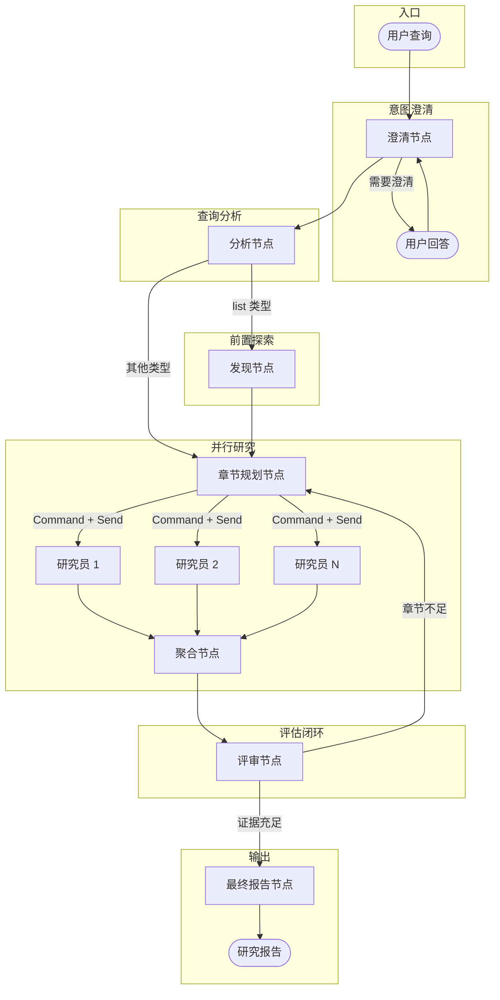

# Research Agent

基于 LangGraph、LangChain 与 DeepAgents 的深度研究智能体，通过原生 HTTP/API 工具（ArXiv、Hacker News、Hugging Face、Tavily、RSS、GitHub 等）完成 AI 相关综合调研。

**语言：** [English](README.md) · [简体中文](README.zh-CN.md)

## 功能特性

- **深度研究模式**：按章节并行调研，支持意图澄清、查询分析、实体发现、评审闭环与结构化报告生成
- **智能查询分析**：自动识别查询类型（list / comparison / deep_dive / general）并优化研究策略
- **实体发现**：针对「列表类」问题（如「最好的 X 有哪些？」），在深入调研前先发现相关实体
- **ArXiv 检索**：通过 ArXiv 官方 API 搜索与获取学术论文
- **Hacker News**：通过官方 Firebase API 获取趋势与讨论数据（`src/tools/hacker_news.py`）
- **Hugging Face 论文**：获取 Hugging Face 的日 / 周 / 月 / 趋势 AI/ML 论文列表及元数据
- **Hugging Face 博客**：浏览官方与社区博文及元数据
- **多模型支持**：兼容阿里云（qwen3.5-plus、qwen3-max、kimi-k2.5）、Anthropic Claude、OpenAI GPT
- **思考模式**：部分模型可选开启思考模式（qwen3.5-plus、qwen3-max、kimi-k2.5）
- **模块化架构**：高内聚、低耦合，便于扩展
- **Clerk 认证**：使用 [Clerk](https://clerk.com/) 管理用户登录，Web UI 与 API 统一身份认证

## 两种研究模式

| 能力 | 普通模式 | 深度研究模式 |
|------|----------|--------------|
| 执行方式 | 单轮 ReAct | 多轮状态机 |
| 意图澄清 | 无 | 支持（可跳过） |
| 查询分析 | 无 | 识别查询类型（list / comparison / deep_dive / general） |
| 实体发现 | 无 | 「列表类」查询的前置发现 |
| 研究规划 | 隐式 | 显式生成章节 |
| 并行执行 | 无 | 按章节并行调研 |
| 评审机制 | 无 | 评审节点评估证据是否充分 |
| 上下文管理 | 累积全部消息 | 研究员层级压缩 |
| 适用场景 | 简单问答、快速检索 | 深度调研、综合报告 |

## 架构

### 深度研究图流程



## 环境要求

- Python 3.11+
- [uv](https://github.com/astral-sh/uv)（推荐）或 pip
- 阿里云 DashScope（默认）、Anthropic 或 OpenAI 的 API 密钥
- 按需配置可选集成：Jina 或 Zyte（内容阅读器）、Tavily（网页搜索）等 — 见 `env.example`
- Clerk 账号与密钥（使用 Web UI 时必需，见 [Clerk 用户认证](#clerk-用户认证)）

## 安装

### 1. 克隆仓库

```bash
git clone <repository-url>
cd research-agent
```

### 2. 使用 uv 配置环境

```bash
# 若尚未安装 uv
curl -LsSf https://astral.sh/uv/install.sh | sh

# 创建虚拟环境并安装依赖
uv venv
source .venv/bin/activate  # Windows: .venv\Scripts\activate
uv pip install -e .
```

### 3. 配置环境变量

在项目根目录创建 `.env`：

```bash
cp env.example .env
```

编辑 `.env` 并填入 API 密钥：

```bash
# 阿里云 DashScope（默认）
# 密钥获取：https://dashscope.console.aliyun.com/
ALIYUN_API_KEY=your-aliyun-dashscope-api-key

# 可用模型：qwen3.5-plus（默认）、qwen3-max、kimi-k2.5

# 或使用其他提供商：
# ANTHROPIC_API_KEY=your-anthropic-api-key
# OPENAI_API_KEY=your-openai-api-key

# Jina API Key（网页内容阅读）
# 获取：https://jina.ai/
JINA_API_KEY=your-jina-api-key

# 可选模型默认值（CLI / API 请求优先级更高）
# MODEL_PROVIDER=aliyun
# MODEL_NAME=qwen3.5-plus
# ENABLE_THINKING=false

# 可选深度研究默认值
# DEEP_RESEARCH_MAX_ITERATIONS=2
# DEEP_RESEARCH_MAX_CONCURRENT=5
# DEEP_RESEARCH_MAX_TOOL_CALLS=10
# DEEP_RESEARCH_ALLOW_CLARIFICATION=true
```

## Web UI 与 API

项目提供 Web 前端与后端 API，可在浏览器中使用研究智能体。

### 启动后端 API

后端基于 FastAPI，提供 REST API 与流式响应。

```bash
# 使用 uvicorn（开发模式热重载，端口 8112）
ENV=development uv run uvicorn src.api.main:app --reload --port 8112

# 或使用 Python 模块（ENV=development 时默认 8112）
ENV=development uv run python -m src.api.main
```

端口随环境变化：

| 环境 | 默认端口 |
|------|----------|
| 开发 | 8112 |
| 生产 | 8111 |

可通过环境变量覆盖：

```bash
API_HOST=0.0.0.0  # 默认 0.0.0.0
API_PORT=8112     # 显式覆盖（优先于按 ENV 的默认端口）
```

### 生产部署

生产环境建议使用 `uv run` 保证环境一致，并关闭热重载：

```bash
# uvicorn 生产模式
# 日志写入项目根目录 logs/app.log（不存在则自动创建）
ENV=production uv run uvicorn src.api.main:app --host 0.0.0.0 --port 8111  # 生产默认 8111

# 自定义日志路径（可选）
ENV=production LOG_FILE=/path/to/your/app.log \
  uv run uvicorn src.api.main:app --host 0.0.0.0 --port 8111
```

### 启动前端 UI

前端为 Next.js，位于 `web-ui/`。

```bash
cd web-ui

# 首次安装依赖
npm install

# 开发服务器
npm run dev

# 或生产构建
npm run build && cp -r .next/static .next/standalone/.next/static
npm run start:prod
```

开发服务器默认 `http://localhost:3001`（生产常用 3000）。

**注意**：前端需连接后端 API，请先启动后端。

### Clerk 用户认证

Web UI 与 API 使用 [Clerk](https://clerk.com/) 作为登录与身份服务，前后端认证一致。

#### 获取 Clerk 密钥

1. 打开 [Clerk Dashboard](https://dashboard.clerk.com/)
2. 创建应用或选择已有应用
3. 在 **API Keys** 页面获取：
   - **Publishable Key**：前端使用（`pk_` 开头）
   - **Secret Key**：后端使用（`sk_` 开头）

#### 前端配置

在 `web-ui/` 下创建 `.env.local`（可参考 `web-ui/.env.local.example`）：

```bash
NEXT_PUBLIC_CLERK_PUBLISHABLE_KEY=pk_test_xxxx
CLERK_SECRET_KEY=sk_test_xxxx
```

#### 后端配置

在项目根目录 `.env` 中添加：

```bash
# Clerk 认证（保护 API 时必需）
CLERK_SECRET_KEY=sk_test_xxxx
# 可选：允许的前端域名（逗号分隔），默认包含 localhost 等开发地址
# CLERK_AUTHORIZED_PARTIES=http://localhost:3000,https://your-production-domain.com
```

#### 部署说明

生产环境 Next.js standalone 模式下需确保 Clerk 环境变量正确加载（例如通过 `dotenv-cli`）。详见 [部署网络问题排查 — Clerk secretKey 缺失](docs/deployment-network-troubleshooting.md#31-clerk-secretkey-缺失)。

## 使用方式

### 交互模式

```bash
# 默认配置（阿里云 qwen3.5-plus）
uv run python -m src.main

# 使用 kimi-k2.5
uv run python -m src.main --model kimi-k2.5

# 开启思考模式（展示推理过程）
uv run python -m src.main --enable-thinking
uv run python -m src.main --model kimi-k2.5 --enable-thinking

# 使用 Anthropic 或 OpenAI
uv run python -m src.main -p anthropic
uv run python -m src.main -p openai
uv run python -m src.main -p openrouter --model openai/gpt-4o
```

### 单次查询模式

```bash
uv run python -m src.main -q "帮我深度总结一下 hacker news 和 huggingface 上今天的热门话题和论文的主要内容，并形成一篇详细的报告" -v

# 开启思考模式
uv run python -m src.main -q "分析最新的 LLM 论文趋势" --enable-thinking -v
```

### 深度研究模式

深度研究模式采用分章节并行架构，包含意图澄清、章节规划、并行执行与迭代评审。

```bash
# 交互
uv run python -m src.main --deep-research

# 带查询
uv run python -m src.main --deep-research -q "RAG 技术的最新进展有哪些？"

# 自定义评审轮数（默认 2）
uv run python -m src.main --deep-research --max-iterations 3 -q "对比 Llama 3 和 GPT-4 的技术架构"

# 详细日志
uv run python -m src.main --deep-research -v

# 指定提供商
uv run python -m src.main --deep-research -p anthropic -q "Transformer 的注意力机制演进"

# 指定模型
uv run python -m src.main --deep-research --model kimi-k2.5 -q "LLM 推理优化技术"
```

深度研究参数优先级：**CLI 参数 > 环境变量 > 默认值**。  
默认值：`max_iterations=2`、`max_concurrent=5`、`max_tool_calls=10`。  
允许范围：`max_iterations` 1–5、`max_concurrent` 1–10、`max_tool_calls` 1–20。

**深度研究流程：**
1. **澄清** — 查询模糊时追问（可跳过）
2. **分析** — 识别查询类型并决定输出形式
3. **发现**（仅 list 类）— 广搜发现相关实体
4. **规划章节** — 根据查询或实体生成 3–7 个独立研究章节
5. **并行研究** — 各章节并行调用工具调研
6. **评审** — 评估各章节证据是否充分
7. **迭代或出报告** — 有缺口则补研，否则生成终稿

架构细节见 [`src/deep_research/README.md`](src/deep_research/README.md)。

### 编程调用

#### 普通模式

```python
from src.agent.research_agent import run_research

result = run_research(
    query="Summarize today's Hugging Face papers on transformers",
    model_provider="aliyun",  # 或 "anthropic", "openai", "openrouter"
    model_name="qwen3.5-plus",
    enable_thinking=True,  # 可选；部分 DashScope 模型支持
)
print(result)
```

异步请使用同模块的 `run_research_async`。

#### 深度研究模式

```python
import asyncio
from src.deep_research import build_deep_research_graph, run_deep_research

async def main():
    graph = build_deep_research_graph(
        model_provider="aliyun",
        model_name="qwen3.5-plus",
    )

    async def on_clarify(question: str) -> str:
        return input(f"Agent asks: {question}\nYour answer: ")

    config = {
        "configurable": {
            "thread_id": "research-session-1",
            "max_tool_calls": 10,
            "max_iterations": 2,
            "model_provider": "aliyun",
            "model_name": "qwen3.5-plus",
        }
    }

    report = await run_deep_research(
        query="LLM 推理优化的最新技术",
        graph=graph,
        config=config,
        on_clarify_question=on_clarify,
    )
    print(report)

asyncio.run(main())
```

## 可用工具

具体工具取决于**模式**与**运行的智能体**。下表统计本仓库注册的**业务工具**数量（名称与文件见链接文档）。

| 场景 | 工具数 | 说明 |
|------|--------|------|
| **主智能体**（普通 / 交互） | **21** | ArXiv、HF 论文与博客、GitHub、Tavily、Zyte 文章列表、RSS 三件套、HN（Firebase） |
| **内容阅读子智能体** | **2** | GitHub README + **一种** URL 阅读器（`jina` 或 `zyte`） |
| **深度研究 — 研究员 / 发现** | **22** | 20 个研究工具 + `research_complete` + `think`（图中无 RSS） |
| **深度研究 — 澄清节点** | **1** | 仅 `tavily_search_tool` |

主智能体基于 **DeepAgents**，还会注入框架工具（如 `write_todos`、虚拟文件、`task` 委派子智能体等），**不计入**上表。

**完整工具清单与维护说明：** [docs/agent_tools.md](docs/agent_tools.md)

### 内容阅读器后端

```bash
# zyte（默认）或 jina
CONTENT_READER_TYPE=zyte
```

| 阅读器 | 说明 | 成本 |
|--------|------|------|
| Jina | 网页转 Markdown | 有免费档 |
| Zyte | 结构化正文（标题、作者、正文等） | 付费 |

## 示例查询

### 普通模式（快速调研）

```
📚 "What are the top papers on Hugging Face today about vision-language models?"

📚 "Search ArXiv for recent papers on reinforcement learning from human feedback"

📚 "What's trending on Hacker News about AI startups?"
```

### 深度研究模式（综合报告）

```
📖 "RAG 技术的最新进展有哪些？"

📖 "对比 Llama 3 和 GPT-4 的技术架构"

📖 "Give me a comprehensive report on the latest advances in multimodal AI,
    including papers from ArXiv and Hugging Face, and relevant HN discussions"

📖 "Analyze the evolution of attention mechanisms in Transformers,
    covering sparse attention, linear attention, and recent innovations"
```

## 开发

### 运行测试

```bash
uv pip install -e ".[dev]"
pytest
```

### 代码格式

```bash
ruff check src/
ruff format src/
```

## 故障排除

### API 密钥错误

1. 确认项目根目录存在 `.env` 且密钥有效
2. 确认已安装 `python-dotenv`
3. 检查密钥额度/配额
4. 使用 Jina 阅读器时需设置 `JINA_API_KEY`

### Clerk 认证问题

1. 前后端均配置正确的 Clerk 密钥（`NEXT_PUBLIC_CLERK_PUBLISHABLE_KEY`、`CLERK_SECRET_KEY`）
2. 生产 standalone 需通过 `dotenv-cli` 等加载 `.env.local`
3. 跨域时检查 `CLERK_AUTHORIZED_PARTIES` 是否包含前端域名
4. 详见 [部署网络问题排查](docs/deployment-network-troubleshooting.md)

## 许可证

MIT License — 见 [LICENSE](LICENSE)。

## 致谢

- [LangChain](https://langchain.com/) — LLM 框架
- [LangGraph](https://langchain-ai.github.io/langgraph/) — 智能体图框架
- [ArXiv API](https://info.arxiv.org/help/api/index.html) — 学术论文检索
- [Hacker News API](https://github.com/HackerNews/API) — 故事与评论（Firebase JSON）
- [Hugging Face](https://huggingface.co/) — 日 / 周 / 月 / 趋势论文与博客源
- [Jina AI](https://jina.ai/) — 网页内容阅读
- [Clerk](https://clerk.com/) — 用户登录与身份认证
