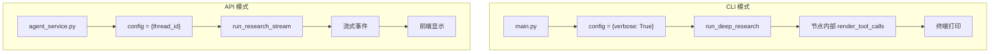
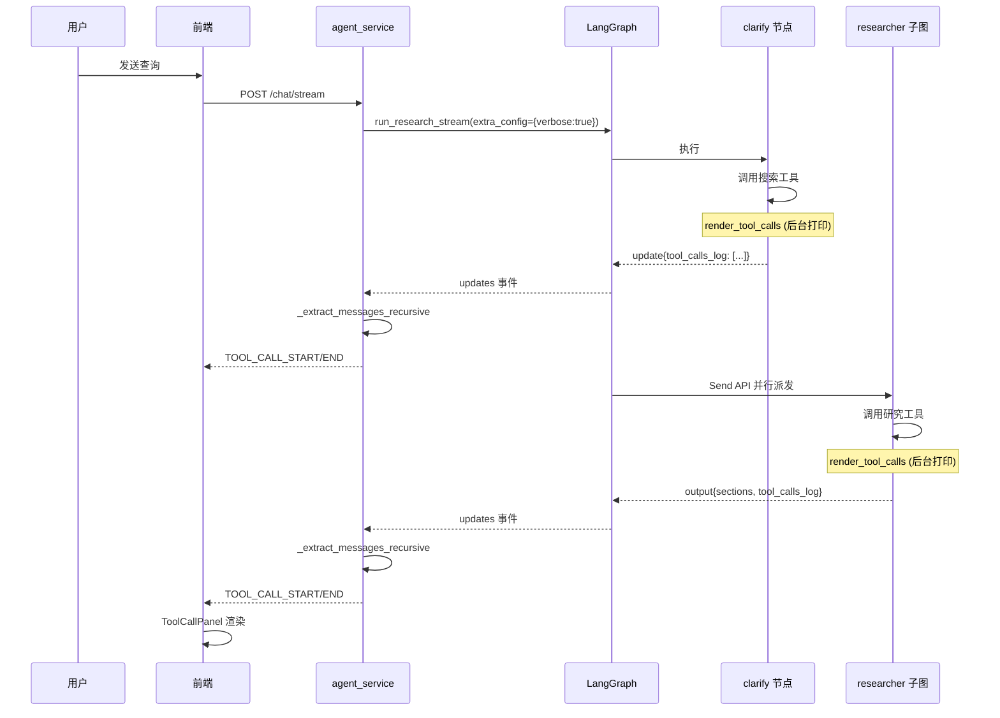

## Deep Research 工具调用显示问题：完整分析与解决方案

### 一、问题现象

在 Deep Research 模式下，工具调用信息无法在前端和后台显示，而 CLI 模式（`-v` 参数）能正常显示格式化的工具调用。

### 二、根本原因分析

#### 2.1 架构差异



**关键差异**：
- **CLI 模式**：通过 `configurable["verbose"] = True` 传递配置，节点内部直接调用 `render_tool_calls` 打印
- **API 模式**：只传递 `thread_id`，没有 `verbose` 配置，节点内部不打印

#### 2.2 Researcher 子图的隔离性

Deep Research 使用 **子图架构**：

```python
# graph.py
researcher_subgraph = build_researcher_subgraph(all_tools)
workflow.add_node("researcher", researcher_subgraph)  # 作为子图添加
```

子图有独立的状态空间：

| 状态类型 | 包含字段 | 作用域 |
|---------|---------|--------|
| `ResearcherState` | `researcher_messages`, `section`, ... | 子图内部 |
| `ResearcherOutputState` | `sections` (原来只有这个) | 子图→主图 |
| `AgentState` | `messages`, `tool_calls_log`, ... | 主图 |

**问题**：`researcher_messages`（包含工具调用）存在于子图内部，不会自动暴露到主图的流式更新中。

#### 2.3 流式传输的层级

LangGraph 的 `astream(stream_mode=["updates", "messages"])` 会传输：
- **主图节点更新**：直接可见
- **子图内部更新**：以嵌套格式传输，如 `{"researcher": {"researcher": {...}}}`

原来的代码只检查第一层：
```python
# 只能提取到主图级别的 messages
messages = node_data.get("messages", [])
```

### 三、解决方案

#### 3.1 状态字段传递（子图→主图）

**修改 `state.py`**：

```python
# AgentState 添加累积式工具调用日志
tool_calls_log: Annotated[list[AnyMessage], operator.add] = []

# ResearcherOutputState 添加输出字段
class ResearcherOutputState(TypedDict):
    sections: list[Section]
    tool_calls_log: list[AnyMessage]  # 新增
```

**修改 `researcher.py`**：

```python
# _compress_and_output_node 输出工具调用日志
return {
    "sections": [completed_section],
    "tool_calls_log": researcher_messages,  # 传递到主图
}
```

**数据流**：
```
researcher_messages (子图内部)
    ↓ _compress_and_output_node
tool_calls_log (ResearcherOutputState)
    ↓ LangGraph reducer (operator.add)
tool_calls_log (AgentState) - 累积多个 researcher 的结果
    ↓ agent_service.py 流式提取
TOOL_CALL_START/END 事件
    ↓
前端 ToolCallPanel
```

#### 3.2 递归解析嵌套更新

**添加 `_extract_messages_recursive` 方法**：

```python
@staticmethod
def _extract_messages_recursive(data: Any, max_depth: int = 5) -> list:
    """
    递归提取嵌套节点数据中的消息。
    处理子图更新格式：{"researcher": {"researcher": {"researcher_messages": [...]}}}
    """
    if max_depth <= 0 or data is None:
        return []
    
    if hasattr(data, "value"):  # 处理 Overwrite 包装
        data = data.value
    
    if not isinstance(data, dict):
        return []
    
    all_messages = []
    message_fields = ["messages", "researcher_messages", "tool_calls_log"]
    
    for key, value in data.items():
        if hasattr(value, "value"):
            value = value.value
        
        if key in message_fields:
            if isinstance(value, (list, tuple)):
                all_messages.extend(value)
        elif isinstance(value, dict):
            # 递归处理嵌套
            all_messages.extend(
                AgentService._extract_messages_recursive(value, max_depth - 1)
            )
    
    return all_messages
```

#### 3.3 启用后台 Verbose 打印

**修改 `research_agent.py`**：

```python
async def run_research_stream(
    query: str,
    agent: Any,
    thread_id: Optional[str] = None,
    extra_config: Optional[dict] = None,  # 新增参数
) -> AsyncGenerator[tuple[str, Any], None]:
    configurable = {"thread_id": thread_id} if thread_id else {}
    if extra_config:
        configurable.update(extra_config)  # 合并额外配置
    config = {"configurable": configurable}
```

**修改 `agent_service.py`**：

```python
# Deep Research 模式启用 verbose
extra_config = None
if is_deep_research:
    extra_config = {
        "verbose": True,  # 启用节点内部打印
        "model_provider": model_provider,
        "model_name": model_name,
    }

async for mode, chunk in run_research_stream(
    query=message,
    agent=agent,
    thread_id=conversation_id,
    extra_config=extra_config,
):
```

#### 3.4 Clarify 节点工具调用暴露

**修改 `clarify.py`**：

```python
# 收集工具调用日志
clarify_tool_calls_log: list = []

for i in range(max_iterations):
    response = await llm_with_tools.ainvoke(tool_messages)
    if not response.tool_calls:
        break
    
    # CLI verbose 打印
    if deep_config.verbose:
        render_tool_calls(response.tool_calls, verbose=True, section_title="Clarify")
    
    # 收集用于状态更新
    clarify_tool_calls_log.append(response)  # AIMessage
    clarify_tool_calls_log.extend(tool_results)  # ToolMessage

# Command.update 包含工具调用日志
return Command(
    goto="analyze",
    update={
        "messages": [...],
        "tool_calls_log": clarify_tool_calls_log,  # 新增
    },
)
```

### 四、完整数据流



### 五、效果对比

| 场景 | 修复前 | 修复后 |
|------|--------|--------|
| 后台打印 (clarify) | 简单 print | `render_tool_calls` 格式化 |
| 后台打印 (researcher) | 无 | `render_tool_calls` 格式化 |
| 前端显示 (clarify) | 无 | ToolCallPanel 实时显示 |
| 前端显示 (researcher) | 无 | ToolCallPanel 实时显示 |

### 六、关键技术点总结

1. **子图状态隔离**：子图输出状态需要显式包含要传递的字段
2. **累积式 Reducer**：`operator.add` 让多个 researcher 的工具调用能累积
3. **递归解析**：处理嵌套的子图更新格式
4. **配置传递**：`extra_config` 参数让 API 模式也能使用 CLI 的配置