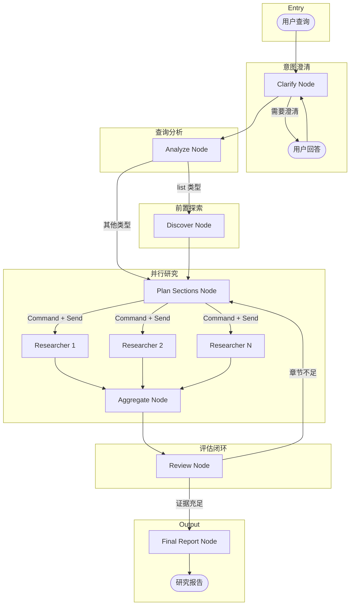

# Deep Research Mode

Deep Research Mode 是一个基于 LangGraph StateGraph 构建的深度研究模块，实现了 **"澄清意图 → 查询分析 → 前置探索 → 规划章节 → 并行研究 → 评估反思 → 生成报告"** 的基于 Section 的并行研究流程。

## 架构概览



## 核心设计

### State（状态）

#### 主图状态 (`AgentState`)

主图使用 `AgentState` 定义在 `state.py` 中，继承自 `MessagesState`：

| 字段 | 类型 | 说明 |
|------|------|------|
| `messages` | `list[AnyMessage]` | 对话消息列表（继承） |
| `original_query` | `str` | 用户原始查询 |
| `query_type` | `Literal["list", "comparison", "deep_dive", "general"]` | 查询类型（由 Analyze 节点识别） |
| `output_format` | `Literal["table", "list", "prose"]` | 期望输出格式 |
| `discovered_items` | `list[DiscoveredItem]` | 前置探索发现的实体列表 |
| `discovery_complete` | `bool` | 前置探索是否完成 |
| `discovery_summary` | `str` | 整体检索摘要 |
| `research_brief` | `str` | 研究简报（澄清后生成） |
| `sections` | `list[Section]` | 章节列表（使用自定义 reducer） |
| `review_iterations` | `int` | Review 迭代轮数 |
| `max_review_iterations` | `int` | 最大 Review 迭代轮数 |
| `final_report` | `str` | 最终研究报告 |

#### Section 模型

`Section` 是研究的核心数据结构，每个 Section 代表报告中的一个独立章节：

| 字段 | 类型 | 说明 |
|------|------|------|
| `title` | `str` | 章节标题 |
| `description` | `str` | 研究指导/描述 |
| `status` | `Literal` | `pending` / `researching` / `completed` |
| `content` | `str` | 研究内容（由 researcher 填充） |
| `sources` | `list[str]` | 信息来源列表 |

**Section Reducer**：`section_reducer` 函数根据 `title` 匹配并合并更新，实现状态的增量更新。

#### DiscoveredItem 模型

`DiscoveredItem` 是前置探索阶段发现的实体，用于 list 类型查询：

| 字段 | 类型 | 说明 |
|------|------|------|
| `name` | `str` | 实体名称（如模型名、项目名） |
| `category` | `str` | 分类/类别 |
| `brief` | `str` | 简要描述 |
| `source` | `str` | 发现来源 |
| `urls` | `list[str]` | 相关链接（GitHub/官网/论文） |

#### Researcher 状态 (`ResearcherState`)

每个并行的 researcher 实例使用独立的 `ResearcherState`：

| 字段 | 类型 | 说明 |
|------|------|------|
| `messages` | `list[AnyMessage]` | 继承自 MessagesState |
| `section` | `Section` | 要研究的章节（从 Send 接收） |
| `research_brief` | `str` | 研究上下文 |
| `researcher_messages` | `list[AnyMessage]` | 工具调用消息 |
| `tool_call_iterations` | `int` | 工具调用轮数 |
| `max_tool_calls` | `int` | 最大工具调用次数 |
| `is_complete` | `bool` | 研究是否完成 |

### 节点（Nodes）

#### 1. Clarify Node - 意图澄清

**职责**：分析用户查询，判断是否足够清晰。若模糊则生成澄清问题。

**实现**：`src/deep_research/nodes/clarify.py`

**Prompt 模板**：`src/prompts/templates/deep_research/clarify.md`

**结构化输出**：`ClarifyWithUser` 模型
```python
{
  "need_clarification": true/false,      # 是否需要澄清
  "question": "需要问用户的问题",          # 澄清问题
  "verification": "确认开始研究的消息"     # 不需要澄清时的确认消息
}
```

**交互逻辑**：
- 用户可以回答"直接开始研究"跳过澄清
- 支持多轮澄清对话（直到用户明确或跳过）
- 使用 **Command API** 控制路由

**路由**（使用 Command API）：
- `need_clarification=true` → `Command(goto=END)` 中断等待用户输入
- `need_clarification=false` → `Command(goto="analyze")` 继续分析查询

#### 2. Analyze Node - 查询分析

**职责**：分析用户查询类型，决定是否需要前置探索（discover）阶段。

**实现**：`src/deep_research/nodes/analyze.py`

**Prompt 模板**：`src/prompts/templates/deep_research/analyze.md`

**查询类型识别**：
| 类型 | 说明 | 示例 |
|------|------|------|
| `list` | "有哪些"类型，枚举/列表查询 | "有哪些开源 LLM？" |
| `comparison` | 对比分析 | "GPT-4 和 Claude 3 的区别" |
| `deep_dive` | 深入研究单一主题 | "详细解释 Transformer 注意力机制" |
| `general` | 一般性查询 | "LLM 的最新进展" |

**结构化输出**：`QueryAnalysis` 模型
```python
{
  "query_type": "list",           # 查询类型
  "output_format": "table",       # 期望输出格式 (table/list/prose)
  "needs_discovery": true,        # 是否需要前置探索
  "discovery_target": "开源 LLM", # 要发现的目标类型
  "reasoning": "分析理由"
}
```

**路由**（使用 Command API）：
- `query_type="list"` 且 `needs_discovery=true` → `Command(goto="discover")` 前置探索
- 其他情况 → `Command(goto="plan_sections")` 直接规划章节

#### 3. Discover Node - 前置探索

**职责**：执行广泛的整体检索，发现所有相关实体。实现"先整体检索，再分别深入"策略。

**实现**：`src/deep_research/nodes/discover.py`

**Prompt 模板**：`src/prompts/templates/deep_research/discover.md`

**触发条件**：仅当 `query_type="list"` 时执行，其他类型跳过。

**子图流程**：
```
START → discover_invoke → discover_tools → [循环或提取] → extract_output → END
```

**结构化输出**：`DiscoveryResult` 模型
```python
{
  "entities": [
    {
      "name": "LLaMA 3",
      "category": "开源基础模型",
      "brief": "Meta 发布的开源大语言模型",
      "source": "HuggingFace",
      "priority": "high"
    }
  ],
  "summary": "整体发现摘要",
  "total_found": 10,
  "categories": ["开源基础模型", "指令微调模型"],
  "search_coverage": "搜索覆盖说明"
}
```

**迭代控制**：
- 最多执行 `max_discover_iterations` 轮搜索（默认 5 轮）
- 调用 `research_complete` 工具时提前完成
- 完成后通过 `extract_output` 节点提取结构化实体列表

**与 Plan Sections 的协作**：
- 发现的实体列表传递给 Plan Sections 节点
- Plan Sections 可基于实体列表生成专门的章节（如每个实体一个章节）
- 使用 `brief_from_discovery.md` 模板生成基于实体的研究大纲

#### 4. Plan Sections Node - 章节规划

**职责**：将研究问题分解为 3-7 个独立的章节，每个章节可并行研究。

**实现**：`src/deep_research/nodes/brief.py`

**Prompt 模板**：
- `src/prompts/templates/deep_research/plan.md`（标准查询）
- `src/prompts/templates/deep_research/brief_from_plan.md`（基于澄清结果）
- `src/prompts/templates/deep_research/brief_from_discovery.md`（基于前置探索结果）

**结构化输出**：`ResearchBrief` 模型
```python
{
  "title": "研究报告标题",
  "objective": "研究目标一句话描述",
  "sections": [
    {
      "title": "章节标题",
      "description": "该章节的研究指导"
    }
  ],
  "scope": "研究范围说明"
}
```

**关键特性**：
- 生成的章节应相互独立，可以并行研究
- 每个章节有明确的研究方向
- 章节数量适中（3-7 个），避免过细或过粗
- **幂等性**：如果已有 sections（Review 循环回来），跳过重新生成
- 使用 **Command API** 直接派发 Researcher 任务

**路由**（使用 Command + Send API）：
```python
# 构建 Send 列表，派发所有 pending 的章节
sends = [
    Send("researcher", {"section": s, "research_brief": brief_text, ...})
    for s in sections if s.status == "pending"
]
# 使用 Command 同时更新状态并派发任务
return Command(goto=sends, update={"sections": sections, ...})
```

#### 5. Dispatch - 并行分发（内聚于 Plan Sections Node）

**职责**：为每个 `pending` 状态的 Section 创建并行的 Researcher 任务。

**实现**：dispatch 逻辑已内聚到 `plan_sections_node` 中，通过 `Command(goto=[Send, ...])` 实现。

**并行机制**：使用 LangGraph `Command` + `Send` API 实现图级别的并行执行
```python
# plan_sections_node 返回 Command，直接派发 researcher
sends = [Send("researcher", {"section": s, ...}) for s in pending_sections]
return Command(goto=sends, update={...})
```

> **设计说明**：将 dispatch 逻辑内聚到 Plan Sections Node 中，使得"规划"和"派发"在同一个节点完成，代码更内聚，图结构更简洁。

#### 6. Researcher Subgraph - 研究执行

**职责**：接收 Section，执行工具调用，填充研究内容。

**实现**：`src/deep_research/nodes/researcher.py`（子图结构）

**Prompt 模板**：`src/prompts/templates/deep_research/researcher.md`

**子图流程**：
```
START → researcher_invoke → tools → [循环或完成] → compress_output → END
```

**可用工具**：
| 工具类别 | 具体工具 | 优先级 |
|---------|---------|--------|
| **学术论文** | `search_arxiv_papers_tool`, `get_arxiv_paper_tool` | 高 |
| **AI 社区** | `get_huggingface_papers_tool`, `get_huggingface_blog_posts_tool` | 高 |
| **代码平台** | `github_search_tool`, `get_github_readme_tool` | 中 |
| **技术博客** | `get_zyte_article_list_tool` | 中 |
| **新闻讨论** | Hacker News MCP Tools | 中 |
| **通用搜索** | `bocha_web_search_tool` | 低（兜底） |
| **完成标记** | `research_complete`, `think` | - |

**工具选择策略**：
- LLM 根据章节内容自动选择合适工具
- 优先使用高信噪比信源（学术论文、官方文档）
- `research_complete` 工具用于标记章节研究完成
- `think` 工具用于记录推理过程

**结构化输出**：`SectionContent` 模型
```python
{
  "title": "章节标题",
  "content": "研究内容（Markdown）",
  "sources": ["信息来源列表"],
  "key_findings": ["关键发现"]
}
```

**迭代控制**：
- 最多调用 `max_tool_calls` 次工具（默认 10 次）
- 调用 `research_complete` 工具时提前完成
- 达到上限时强制完成并压缩输出

**Context 压缩**：使用 `compress_output` 节点压缩工具消息，避免上下文膨胀

#### 7. Aggregate Node - 结果聚合

**职责**：作为所有并行 Researcher 的汇聚点（Fan-in）。

**实现**：`aggregate_sections_node` 函数（在 `graph.py` 中）

**处理逻辑**：
- 由于 `section_reducer` 已处理状态合并，此节点主要作为同步点
- 等待所有并行 researcher 完成后继续执行
- 可选地打印调试信息（已完成章节数量）

#### 8. Review Node - 评估反思

**职责**：评估所有章节的研究充分性，决定是否需要继续研究。

**实现**：`src/deep_research/nodes/review.py`

**Prompt 模板**：`src/prompts/templates/deep_research/reflect.md`

**评估维度**：
- **覆盖度**：每个章节是否有足够信息
- **深度**：是否有技术细节而非仅概述
- **多样性**：信息来源是否多样
- **一致性**：不同来源是否矛盾
- **时效性**：是否包含最新进展

**结构化输出**：`ReviewResult` 模型
```python
{
  "is_sufficient": true/false,
  "overall_score": 8,  # 1-10
  "section_coverage": [
    {
      "title": "章节标题",
      "status": "sufficient" / "partial" / "missing",
      "notes": "具体说明"
    }
  ],
  "gaps": ["缺失的关键信息点"],
  "sections_to_retry": ["需要重新研究的章节"],
  "reasoning": "评估理由"
}
```

**路由逻辑**：
- `is_sufficient=true` → Final Report Node
- `is_sufficient=false` 且未达 `max_review_iterations` → Dispatch（仅重新派发 pending 章节，**不重新生成大纲**）
- 达到最大迭代次数 → 强制进入 Final Report Node

> **设计说明**：Review 打回时不应重新生成研究大纲。大纲是根据用户意图设计的"研究方向"，Review 只是评估"研究执行的充分性"。重新生成大纲会丢失已完成章节的内容，因此 Review 只将特定章节标记为 `pending`，然后重新 dispatch。

#### 9. Final Report Node - 报告生成

**职责**：综合所有章节内容，生成结构化的研究报告。

**实现**：`src/deep_research/nodes/report.py`

**Prompt 模板**：`src/prompts/templates/deep_research/final_report.md`

**报告结构**：
1. **标题与摘要**：100-200 字概述
2. **正文章节**：按研究大纲组织，整合各 Section 内容
3. **结论与展望**：关键洞察 + 未来方向
4. **参考来源**：汇总所有 Section 的 sources

## 配置项

### DeepResearchConfig

配置通过 `RunnableConfig` 的 `configurable` 字段注入，定义在 `state.py`：

| 配置项 | 默认值 | 说明 |
|--------|--------|------|
| `max_tool_calls_per_researcher` | `10` | 每个 researcher 的最大工具调用次数 |
| `max_review_iterations` | `2` | Review 最大迭代轮数 |
| `max_context_tokens` | `100000` | 上下文窗口阈值 |
| `compression_target_tokens` | `8000` | 压缩后的目标 token 数 |
| `allow_clarification` | `True` | 是否允许澄清 |
| `model_provider` | `"aliyun"` | LLM 提供商 |
| `model_name` | `None` | 具体模型名称 |
| `enable_thinking` | `False` | 是否启用思考模式 |

### CLI 参数

| 参数 | 说明 |
|------|------|
| `--deep-research` | 启用 Deep Research 模式 |
| `--max-iterations N` | 设置最大 Review 迭代轮数 |
| `-p, --provider` | 指定 LLM 提供商（aliyun/anthropic/openai） |
| `--model` | 指定具体模型名称 |
| `-v, --verbose` | 启用详细日志 |

## 使用方式

### CLI 启动

```bash
# 交互式模式
python -m src.main --deep-research

# 带查询启动
python -m src.main --deep-research -q "RAG 技术的最新进展有哪些？"

# 自定义迭代轮数
python -m src.main --deep-research --max-iterations 3 -q "对比 Llama 3 和 GPT-4 的技术架构"

# 开启详细日志
python -m src.main --deep-research -v

# 指定 LLM Provider
python -m src.main --deep-research -p anthropic -q "Transformer 的注意力机制演进"

# 使用特定模型
python -m src.main --deep-research --model kimi-k2-thinking -q "LLM 推理优化技术"
```

### 编程调用

```python
from langchain_core.messages import HumanMessage
from langgraph.checkpoint.memory import MemorySaver

from src.deep_research import build_deep_research_graph, run_deep_research

# 构建 Graph（传入 MCP 工具）
graph = build_deep_research_graph(
    hn_mcp_tools=None,  # 可选的 HN MCP 工具
    model_provider="aliyun",
    model_name="qwen3.5-plus",
)

# 定义澄清回调（可选）
async def on_clarify(question: str) -> str:
    return input(f"Agent 问: {question}\n你的回答: ")

# 配置
config = {
    "configurable": {
        "thread_id": "test-123",
        "max_tool_calls_per_researcher": 10,
        "max_review_iterations": 2,
        "model_provider": "aliyun",
        "model_name": "qwen3.5-plus",
    }
}

# 运行研究
report = await run_deep_research(
    query="LLM 推理优化的最新技术",
    graph=graph,
    config=config,
    on_clarify_question=on_clarify,
)

print(report)
```

### 调试单个节点

```bash
# 调试 Clarify 节点
python src/deep_research/tests/debug_clarify_node.py

# 调试完整图
python src/deep_research/tests/debug_full_graph.py
```

## 与普通模式的区别

| 特性 | 普通模式 | Deep Research 模式 |
|------|----------|-------------------|
| 执行方式 | 单轮 ReAct | 多轮状态机迭代 |
| 意图澄清 | 无 | 支持（可跳过） |
| 查询分析 | 无 | 识别查询类型（list/comparison/deep_dive/general） |
| 前置探索 | 无 | 对 list 类型查询先发现实体 |
| 研究规划 | 隐式 | 显式章节生成 |
| 并行执行 | 无 | 基于 Section 的并行研究 |
| 反思机制 | 无 | Review 节点评估证据充足度 |
| 迭代控制 | 无 | 支持（可配置 Review 轮数） |
| 上下文管理 | 累积所有消息 | Researcher 内部压缩 |
| 适用场景 | 简单问答、快速查询 | 深度研究、综述报告 |

## 架构特点

### 1. 查询类型识别与自适应流程

**核心理念**：不同类型的查询需要不同的研究策略。通过 Analyze 节点识别查询类型，动态调整后续流程。

**查询类型**：
| 类型 | 特征 | 处理策略 |
|------|------|----------|
| `list` | "有哪些"、"列举"、"盘点" | 先整体发现所有实体，再分别深入研究 |
| `comparison` | "对比"、"区别"、"vs" | 直接规划对比维度，并行研究各方 |
| `deep_dive` | "详细解释"、"深入分析" | 直接规划章节，深入单一主题 |
| `general` | 一般性查询 | 标准流程，直接规划章节 |

**优势**：
- **更准确的研究策略**：根据查询意图选择最合适的研究方式
- **避免遗漏**：list 类型查询先整体发现，确保不遗漏重要实体
- **输出格式优化**：根据查询类型推荐最佳输出格式（表格/列表/文章）

### 2. 前置探索（Discovery）策略

**核心理念**：对于"有哪些"类型的查询，先执行广泛的整体检索发现所有相关实体，再为每个实体生成专门的研究章节。

**解决的问题**：
- 传统方式：直接规划章节可能遗漏重要实体
- 新方式：先发现再深入，确保研究覆盖完整

**实现流程**：
```
Analyze(识别 list 类型) → Discover(整体检索) → Plan Sections(基于实体生成章节)
```

**示例**：
```
用户查询: "目前有哪些开源的多模态大模型？"

1. Analyze: 识别为 list 类型，需要前置探索
2. Discover: 搜索发现 [LLaVA, Qwen-VL, InternVL, CogVLM, ...]
3. Plan Sections: 为每个模型生成专门章节
4. Parallel Research: 并行研究每个模型
5. Report: 生成完整的多模态大模型综述
```

### 3. 基于 Section 的并行化

**核心理念**：将研究报告分解为独立的 Section，每个 Section 由专门的 Researcher 并行研究。

**优势**：
- **性能提升**：利用 LangGraph Send API 实现图级别的真并行
- **逻辑清晰**：每个 Researcher 专注于单一章节，职责明确
- **易于扩展**：可轻松增加 Section 数量或调整并行度

**实现**：
```python
# Plan Sections Node 使用 Command + Send 派发任务
sends = [Send("researcher", {"section": s, ...}) for s in sections if s.status == "pending"]
return Command(goto=sends, update={"sections": sections, ...})

# Aggregate 阶段
# section_reducer 自动合并所有 Researcher 返回的更新
```

### 4. Researcher 子图设计

**内部循环**：`researcher_invoke → tools → [循环或完成] → compress_output`

**关键决策**：
- **工具调用限制**：`max_tool_calls` 防止无限循环
- **完成信号**：`research_complete` 工具允许提前终止
- **上下文压缩**：压缩节点避免上下文膨胀

### 5. Review 驱动的迭代

**评估维度**：覆盖度、深度、多样性、一致性、时效性

**路由逻辑**：
- Review 评估"是否充足"，并标记 `sections_to_retry`（需要重新研究的章节）
- 打回时**不重新生成大纲**，仅将特定章节状态重置为 `pending`
- 然后直接进入 Dispatch，重新派发 pending 的章节进行研究

**核心原则**：大纲 = 研究方向（Plan 决定），充分性 = 研究执行（Review 评估）。两者职责分离。

### 6. 状态管理

**Section Reducer**：根据 `title` 匹配并合并更新，实现增量更新

**优势**：
- 支持并行更新（多个 Researcher 同时返回结果）
- 支持迭代更新（Review 后重新研究某些章节）

## 架构演进

### 当前实现：Section-based Parallel（基于章节的并行）

**特点**：
- 使用 LangGraph Send API 实现原生并行
- 每个 Section 独立研究，互不干扰
- Review 评估后可重新研究不足的章节

**权衡**：
- ✅ 性能优异（真并行执行）
- ✅ 上下文隔离（Researcher 之间互不影响）
- ⚠️ 章节间协调有限（需通过 Review 节点）
- ⚠️ 信息重复可能性（不同 Section 可能检索相同内容）

### 未来可能的方向

#### 1. Hierarchical Supervisor（层级监督）

**架构**：引入 Supervisor 节点统一调度所有 Researcher

**优势**：
- 更好的章节间协调（Supervisor 可分配任务、避免重复）
- 动态调整研究策略（根据中间结果调整计划）

**代价**：
- 增加复杂度
- Supervisor 成为瓶颈（需串行决策）

#### 2. Shared Memory Pool（共享记忆池）

**架构**：所有 Researcher 共享一个记忆池，避免重复检索

**优势**：
- 减少重复工作
- 提高信息利用率

**代价**：
- 需要额外的去重和索引机制
- 状态管理复杂度增加

#### 3. Streaming Aggregation（流式聚合）

**架构**：Researcher 完成后立即触发部分 Review，而非等待所有完成

**优势**：
- 降低等待时间
- 更快发现问题并重新分配任务

**代价**：
- Review 逻辑需要支持增量评估
- 图结构更复杂

---

## 设计原则

1. **查询感知**：识别查询类型，动态调整研究策略
2. **发现优先**：对 list 类型查询先整体发现，避免遗漏
3. **并行优先**：利用 LangGraph Command + Send API 实现真并行
4. **状态隔离**：每个 Researcher 拥有独立状态，避免冲突
5. **增量更新**：使用自定义 Reducer 支持并行和迭代更新
6. **上下文压缩**：在 Researcher 内部压缩，避免主图上下文膨胀
7. **人在环优化**：支持澄清、Review 人工介入（可选）
8. **路由内聚**：使用 Command API 将路由逻辑内聚到节点中，简化图结构

---

## 附录：关键技术点

### LangGraph Command + Send API

```python
# 在节点中使用 Command + Send 实现并行分发
from langgraph.types import Command, Send

async def plan_sections_node(state, config) -> Command:
    # ... 生成 sections ...
    
    # 构建 Send 列表
    sends = [
        Send("researcher", {"section": s, "research_brief": brief_text, ...})
        for s in sections
    ]
    
    # 使用 Command 同时更新状态并派发任务
    return Command(
        goto=sends,  # 并行派发到 researcher 节点
        update={"sections": sections, "research_brief": brief_text},
    )

# 图中不需要条件边，Command 自动处理路由
workflow.add_node("plan_sections", plan_sections_node)
workflow.add_node("researcher", researcher_subgraph)
workflow.add_edge("researcher", "aggregate")  # Fan-in
```

### Section Reducer

```python
def section_reducer(existing: list[Section], updates: list[Section]) -> list[Section]:
    """根据 title 匹配并合并"""
    result = list(existing)
    existing_titles = {s.title: i for i, s in enumerate(result)}
    for update in updates:
        if update.title in existing_titles:
            result[existing_titles[update.title]] = update  # 替换
        else:
            result.append(update)  # 追加
    return result
```

### 人在环（Human-in-the-Loop）

```python
# Clarify 节点设置 needs_clarification=True 时
if result.get("needs_clarification"):
    answer = await on_clarify_question(result["clarification_question"])
    current_state["messages"].append(HumanMessage(content=answer))
    current_state["needs_clarification"] = False
```

