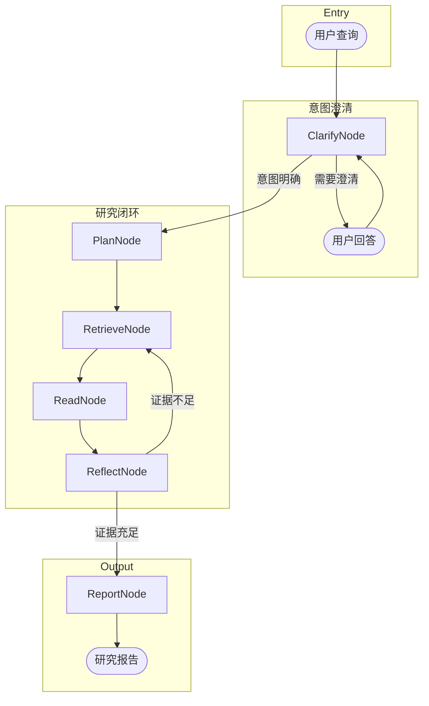

# Deep Research Mode

Deep Research Mode 是一个基于 LangGraph StateGraph 构建的深度研究模块，实现了 **"澄清意图 → 规划大纲 → 检索资料 → 阅读提取 → 反思评估"** 的闭环迭代研究流程，以证据充足度作为终止条件。

## 架构概览



## 核心设计

### State（状态）

所有节点共享一个 `DeepResearchState` 对象，定义在 `state.py` 中：

| 字段 | 类型 | 说明 |
|------|------|------|
| `original_query` | `str` | 用户原始查询 |
| `clarified_query` | `str` | 澄清后的研究问题 |
| `is_clarified` | `bool` | 是否已完成意图澄清 |
| `pending_question` | `str` | 待用户回答的澄清问题 |
| `sections` | `list[dict]` | 研究大纲章节 |
| `gathered_info` | `list[str]` | 累积的研究信息（自动合并） |
| `visited_sources` | `list[str]` | 已访问的信息源（去重） |
| `iteration_count` | `int` | 当前迭代轮数 |
| `max_iterations` | `int` | 最大迭代轮数 |
| `is_sufficient` | `bool` | 证据是否充足 |
| `current_queries` | `list[str]` | 当前轮待执行的搜索查询 |
| `final_report` | `str` | 最终研究报告 |

### 节点（Nodes）

#### 1. ClarifyNode - 意图澄清

**职责**：分析用户查询，判断是否足够清晰。若模糊则生成澄清问题。

**Prompt 模板**：`src/prompts/templates/deep_research/clarify.md`

**输出格式**：
```json
{
  "is_clear": true/false,
  "reasoning": "分析理由",
  "clarification_question": "需要问用户的问题",
  "refined_query": "优化后的研究问题"
}
```

**交互逻辑**：
- 用户可以回答"直接开始研究"跳过澄清
- 最多进行 2-3 轮澄清对话

#### 2. PlanNode - 大纲规划

**职责**：将研究问题分解为 3-5 个结构化章节，每个章节包含建议的搜索查询。

**Prompt 模板**：`src/prompts/templates/deep_research/plan.md`

**输出格式**：
```json
{
  "research_title": "报告标题",
  "sections": [
    {
      "title": "章节标题",
      "description": "该章节要回答的核心问题",
      "search_queries": ["建议的搜索关键词"]
    }
  ]
}
```

#### 3. RetrieveNode - 检索

**职责**：调用工具链执行搜索查询，获取原始信息。

**可用工具**：
| 工具 | 信息源 | 优先级 |
|------|--------|--------|
| `search_arxiv_papers_tool` | ArXiv 论文 | 高 |
| `get_arxiv_paper_tool` | ArXiv 论文详情 | 高 |
| `get_huggingface_papers_tool` | HuggingFace 每日论文 | 高 |
| `get_huggingface_blog_posts_tool` | HuggingFace 博客 | 中 |
| `github_search_tool` | GitHub 仓库/Issue | 中 |
| `get_zyte_article_list_tool` | 指定博客网站 | 中 |
| `bocha_web_search_tool` | 通用网络搜索 | 低（兜底） |
| Hacker News MCP Tools | HN 热门讨论 | 中 |

**工具选择策略**：LLM 根据查询内容自动选择最合适的工具，优先使用高信噪比信源。

#### 4. ReadNode - 阅读提取

**职责**：处理原始搜索结果，提取与研究问题相关的关键信息。

**处理逻辑**：
1. 合并所有搜索结果
2. 调用 LLM 提取关键发现
3. 标注信息来源
4. 过滤无关/重复内容

#### 5. ReflectNode - 反思评估

**职责**：评估当前收集的信息是否足以撰写高质量研究报告。

**Prompt 模板**：`src/prompts/templates/deep_research/reflect.md`

**评估维度**：
- **覆盖度**：每个章节是否有足够信息支撑
- **深度**：是否有技术细节而非仅有概述
- **多样性**：信息来源是否多样
- **一致性**：不同来源是否有矛盾
- **时效性**：是否包含最新进展

**输出格式**：
```json
{
  "is_sufficient": true/false,
  "overall_score": "1-10",
  "gaps": ["缺失的关键信息点"],
  "next_queries": ["下一轮搜索查询"],
  "reasoning": "评估理由"
}
```

**路由逻辑**：
- `is_sufficient: true` → 进入 ReportNode
- `is_sufficient: false` 且未达最大轮数 → 返回 RetrieveNode
- 达到最大轮数 → 强制进入 ReportNode

#### 6. ReportNode - 报告生成

**职责**：综合所有收集的信息，生成结构化的研究报告。

**Prompt 模板**：`src/prompts/templates/deep_research/report.md`

**报告结构**：
1. **摘要**：100-200 字概述
2. **正文**：按大纲章节组织
3. **结论与展望**：关键洞察 + 未来方向

## 配置项

### 环境变量

| 变量名 | 默认值 | 说明 |
|--------|--------|------|
| `DEEP_RESEARCH_MAX_ITERATIONS` | `5` | 最大迭代轮数（范围 1-10） |

### CLI 参数

| 参数 | 说明 |
|------|------|
| `--deep-research` | 启用 Deep Research 模式 |
| `--max-iterations N` | 设置最大迭代轮数（覆盖环境变量） |

**配置优先级**：CLI 参数 > 环境变量 > 默认值

## 使用方式

### CLI 启动

```bash
# 交互式模式
python -m src.main --deep-research

# 带查询启动
python -m src.main --deep-research -q "RAG 技术的最新进展有哪些？"

# 自定义迭代轮数
python -m src.main --deep-research --max-iterations 3 -q "对比 Llama 3 和 GPT-4 的技术架构"

# 开启详细日志
python -m src.main --deep-research -v

# 指定 LLM Provider
python -m src.main --deep-research -p anthropic -q "Transformer 的注意力机制演进"
```

### 编程调用

```python
from src.deep_research.deep_research_agent import (
    build_deep_research_graph,
    run_deep_research,
)

# 构建 Graph
graph = build_deep_research_graph(
    model_provider="aliyun",
    model_name="qwen-max",
    max_iterations=5,
)

# 定义澄清回调（可选）
async def on_clarify(question: str) -> str:
    return input(f"Agent 问: {question}\n你的回答: ")

# 运行研究
report = await run_deep_research(
    query="LLM 推理优化的最新技术",
    graph=graph,
    max_iterations=5,
    on_clarify_question=on_clarify,
)

print(report)
```

## 文件结构

```
src/deep_research/
├── __init__.py
├── README.md                    # 本文档
├── state.py                     # DeepResearchState 定义
└── deep_research_agent.py       # Graph 构建与节点实现

src/prompts/templates/deep_research/
├── clarify.md                   # 意图澄清 Prompt
├── plan.md                      # 大纲规划 Prompt
├── reflect.md                   # 反思评估 Prompt
└── report.md                    # 报告生成 Prompt

src/config/
└── deep_research_config.py      # 配置读取逻辑
```

## 与普通模式的区别

| 特性 | 普通模式 | Deep Research 模式 |
|------|----------|-------------------|
| 执行方式 | 单轮 ReAct | 多轮状态机迭代 |
| 意图澄清 | 无 | 支持（可跳过） |
| 研究规划 | 隐式 | 显式大纲生成 |
| 反思机制 | 无 | 证据充足度评估 |
| 迭代控制 | 无 | 支持（可配置轮数） |
| 适用场景 | 简单问答、快速查询 | 深度研究、综述报告 |

## 演进方向

当前实现采用 **Iterative Loop（迭代循环）** 架构，优先保证推理深度和逻辑连贯性。未来可考虑：

1. **引入 Compress 节点**：在 Read 后、Reflect 前增加信息压缩，缓解 Context Window 压力
2. **并行 Subgraph**：将章节研究并行化，提升执行效率
3. **Supervisor 模式**：引入调度层，支持更复杂的任务分解

